<table width=100% border=>
<tr><td colspan=2></td></tr>
<tr><td colspan=2><h1>EXERCISE 07 - ML Foundation in SAP Cloud Foundry - Preparation</h1></td></tr>
<tr><td><h3>SAP Partner Workshop</h3></td><td><h1> &nbsp;60 min</h1></td></tr>
</table>

## Description
In this exercise, you’ll learn how to

* access SAP Cloud Foundry Org and Space via SAP CP Cockpit
* create Service Instance and Service Key for ML Foundation
* generate an access token with the Generate Token tool
* generate an access token with Postman

## Target group

* Developers
* People interested in SAP Leonardo and Machine Learning

## Goal

The goal of this exercise is to understand how to access SAP Cloud Foundry cockpit, how to setup the ML Foundation service and how to generate a service key for accessing it from an external application.

## Steps

1. [SAP Cloud Foundry Org and Space via SAP CP Cockpit](#cf-org-space)
1. [Create Service Instance and Service Key for ML Foundation](#service-instance-key)
1. [Generate Access Token](#access-token)

###  SAP Cloud Foundry Org and Space via SAP CP Cockpit
You used your SAP Cloud Platform trial account to access the SAP API Business Hub and the SAP Cloud Platform - Neo environment. Now you will learn how to work with ML Foundation Services that are available within your SAP Cloud Platform Global Account.

1. Using Chrome login to the SAP Cloud Platform trial <https://account.hanatrial.ondemand.com/cockpit#/home/trialhome>  
	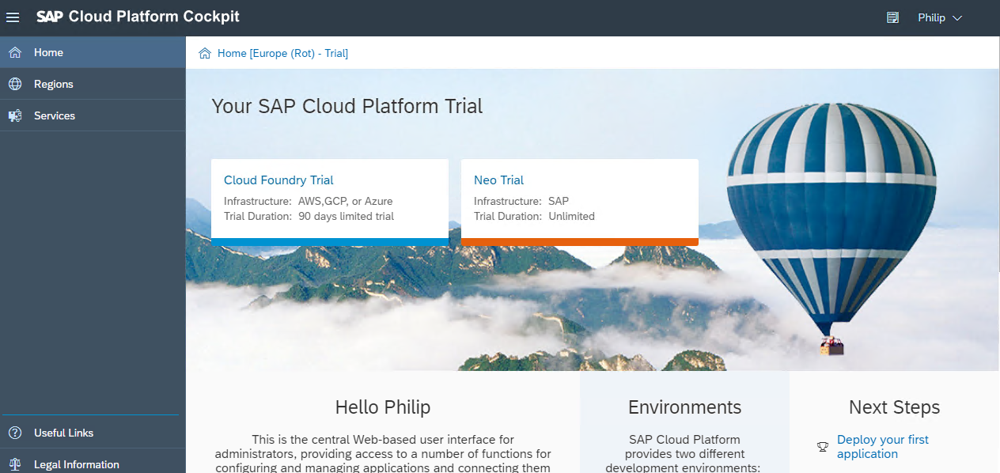

1. Click on **Cloud Foundry Trial** then the **Trial** subaccount  
	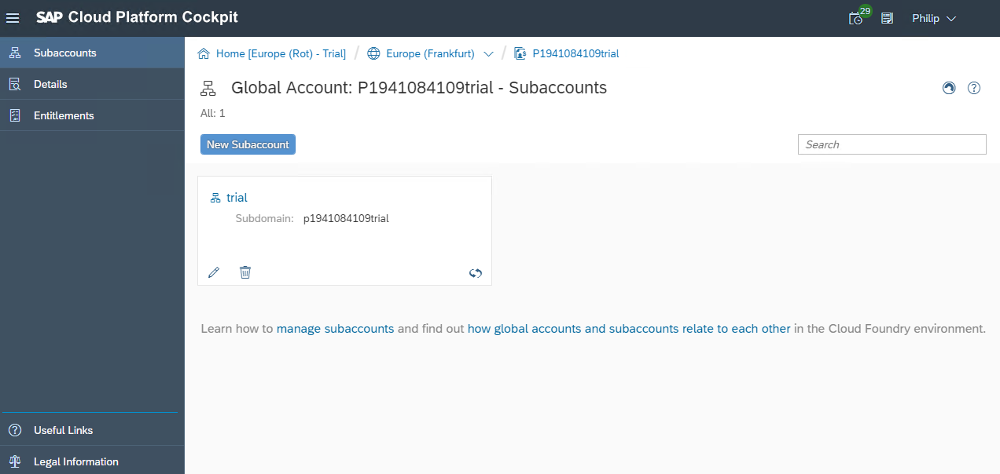

1.	Here you can see some your Cloud Foundry details like the name of your Organization, the number of Spaces and the API endpoint. Click  **Spaces** in the left menu
 	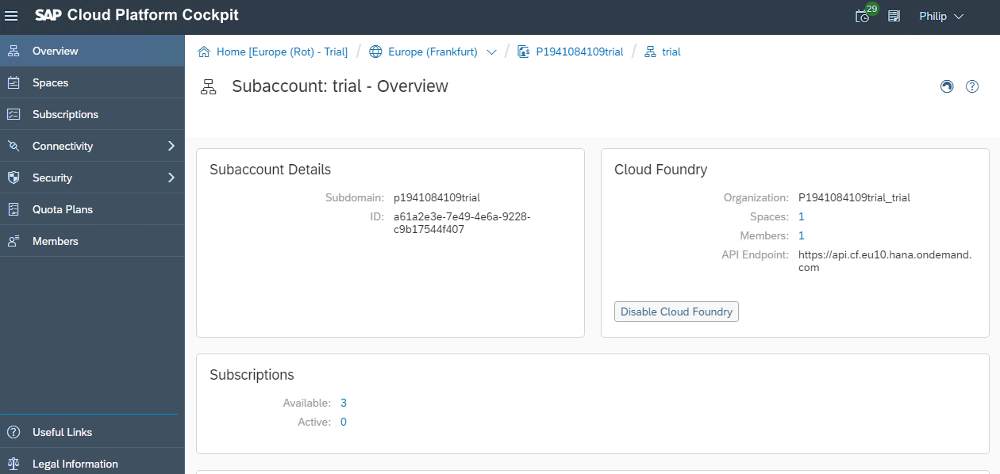

1. Click on the tile named "dev" which is the one related to your space  
	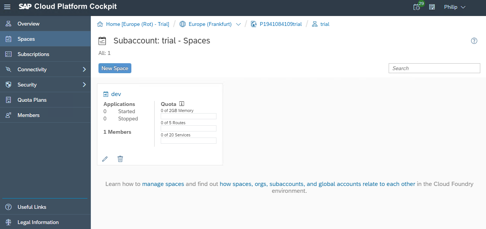

1. You have reached your Cloud Foundry cockpit. At moment there should be no applications available  
	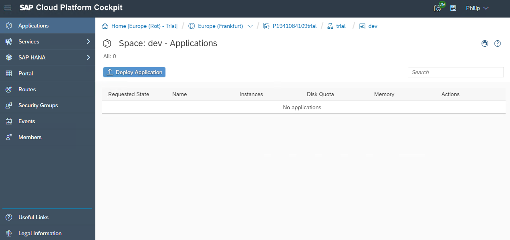

1. You have finished with the preparation of your Cloud Foundry environment.

###  Create Service Instance and Service Key for ML Foundation
Before we continue we need to create a service instance and get a service key from the ML Foundation service. A service key enables the ML Foundation Service to be used outside the CF environment. In this exercise, you need to create such a key to be used by an external application like Swagger UI or Postman. The service key contains all the URLs and credentials (clientid and clientsecret) required for you to access the ML Foundation service running for your trial account. Please keep this browser window open, since you will need it in the next section.

1.	Within your space navigate to **Services -> Service Marketplace**, then click on the **ml-foundation-trial-beta** tile  
	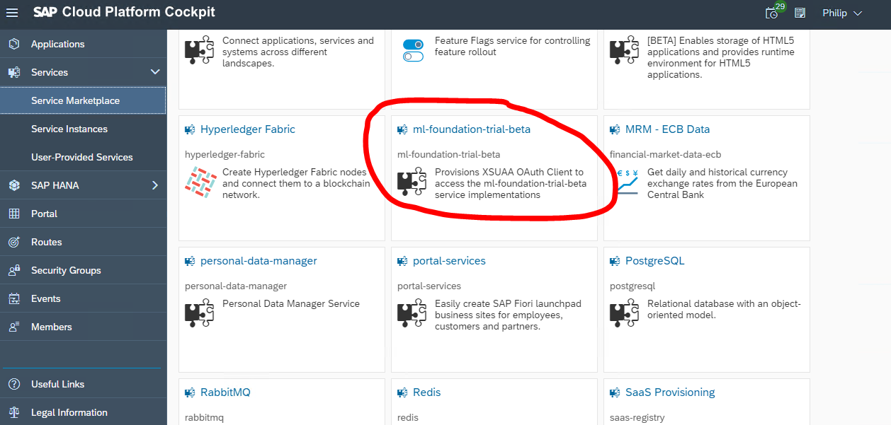

1.	Select Instances on the left menu bar and click on **New Instance**  
	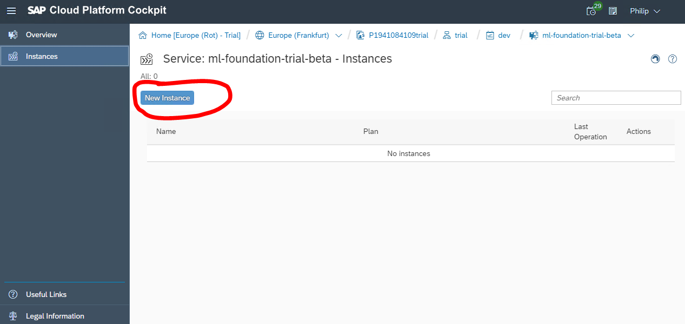

1.	Select the Plan **standard** and click **Next**  
	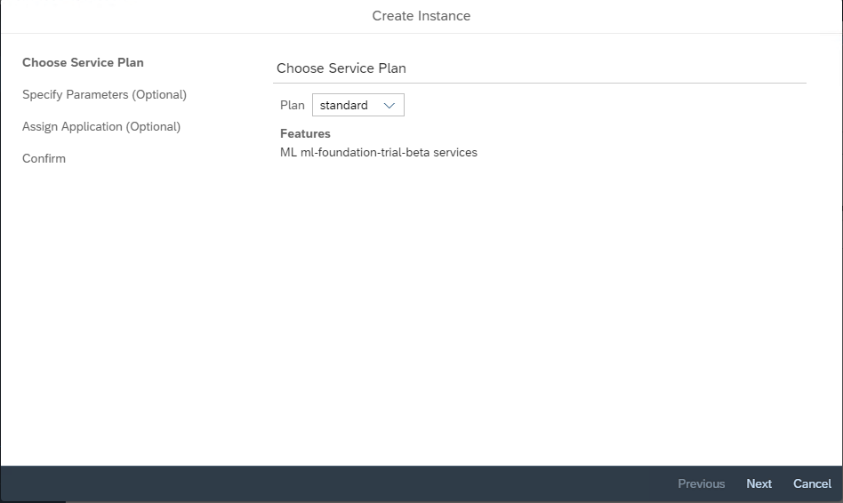

1.	Click **Next**  
	

1.	Click **Next**  
	

1.	Enter a name for the new instance, like **ml** and click **Finish**  
	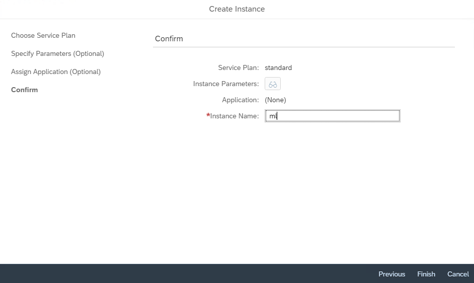

1.	Click on the newly created instance  
	

1.	Select **Service Keys** in the left menu bar and click the **Create Service Key** button to create a new service key for your instance  
	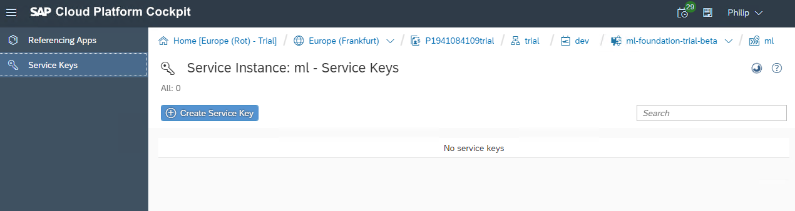

1.	 Enter a name for this service key like **ml-sk** then click **Save** to save the service key  
	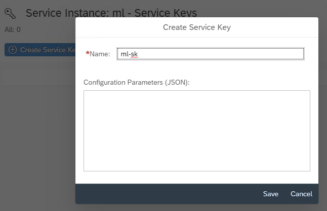

1.	You get a screen like this. Please keep this page open or copy the service key somewhere because you'll need it in the upcoming exercises  
	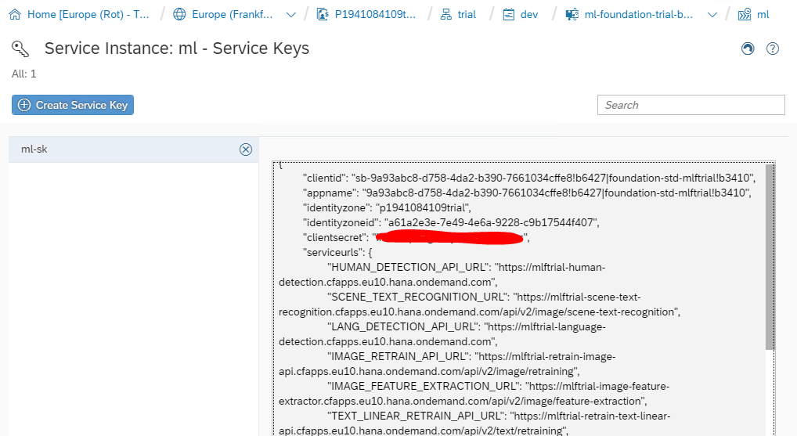

1. You have successfully generated a service key for the ML Foundation service.

###  Generate Access Token
For the upcoming exercises you will need an **OAuth2** token to access the ML Foundation services in your Cloud Foundry environment. We prepared a small helper application to facilitate you to retrieve this token. Please use the URL <https://get_token.cfapps.eu10.hana.ondemand.com/> to access this token generation application: you need to be logged in to your SAP Cloud Foundry account, to access it. This application is a tool that we provide during this workshop, but it is not part of our standard ML Foundation service offering.

>NOTE: You do not need to do this step now! You'll need it several times in the next exercises and we will reference this chapter when needed.

1. With your Chrome browser, navigate to the URL <https://get_token.cfapps.eu10.hana.ondemand.com/>

1. A new window comes up where you need to enter

	- Authentication URL
	- Client-ID
	- Client-Secret  

	

1. Go back to your service key and copy the required information from there. Paste all the needed parameters in the Token Generator app  
	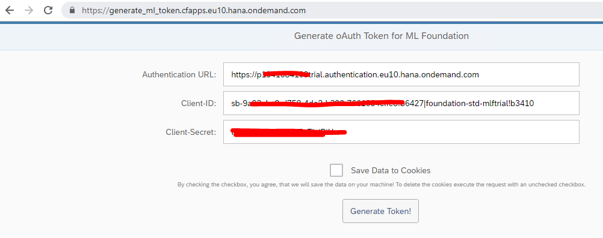

1. A token with the prefix **Bearer** is generated and is valid for up to 12 hours. Use the **Copy To Clipboard!** button to copy the key in the clipboard when needed
	>NOTE: Actually, you do not need to copy the token now, but we will reference this section when you need the token to access the ML foundation services

	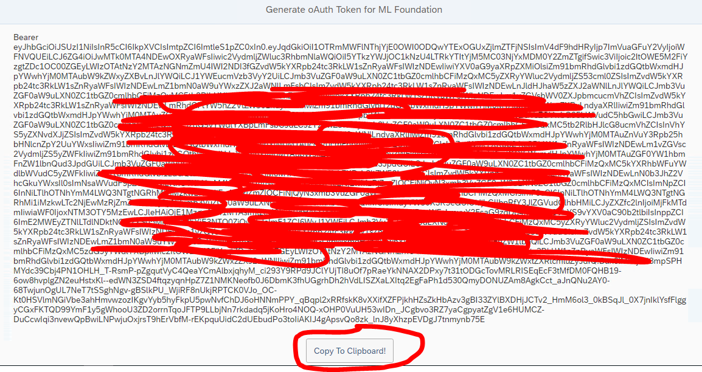

1. It's also possible to obtain the token using Postman. Open a new tab in **Chrome** and open **Postman** from the **Apps** menu
	

1. Go back to **Chrome** and *copy* the service key **url** and paste it into **Postman** and add the following path to the end of the URL: **/oauth/token?grant\_type=client\_credentials**
	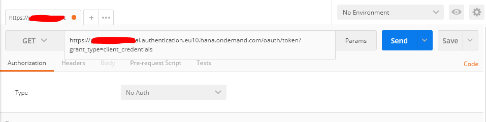

1. Select the **Authorization** tab, choose **Basic Auth** and paste the service key **Client-ID** as *Username* and **Client-Secret** as *Password*
  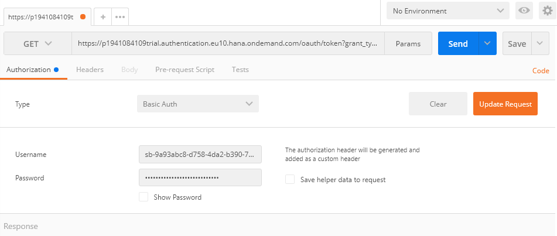

1. Press the **Send** button to send the request and the token will be returned in the **access_token** item. Don't forget to add the prefix **Bearer** with a space when pasting into your application!

## Summary
This concludes the exercise. You should have learned how to

* access SAP Cloud Foundry Org and Space via SAP CP Cockpit
* create Service Instance and Service Key for ML Foundation
* generate an access token with the Generate Token tool
* generate an access token with Postman

Please proceed with next exercise.
