<table width=100% border=>
<tr><td colspan=2></td></tr>
<tr><td colspan=2><h1>EXERCISE 08 - ML Foundation Re-trainable services</h1></td></tr>
<tr><td><h3>SAP Partner Workshop</h3></td><td><h1> &nbsp;60 min</h1></td></tr>
</table>


## Description
In this exercise you will learn how to 'fine-tune' a generic machine learning model to a custom use case. You can use this service without being a Machine Learning Expert. The base model is provided by SAP. The Retrain Service adapts the base model to a specific one using training data provided by the user: thus, the classification results for the user data-set are greatly improved compared to the generic base model.

In this exercise you will:

-	Login to SAP CF using the SAP CF CLI
-	Upload the training data using Minio client
-	Perform retraining process using the SAPML CLI
-	Deploy the retrained model using the SAPML CLI
-	Use the deployed retrained model for inference (with a prepared SAPUI5 app)
-	Use the deployed retrained model for inference (with Postman)

## Target group

* Developers
* People interested in SAP Leonardo and Machine Learning


## Goal

The goal of this exercise is to understand how retrain a generic machine learning model to a custom use case and how to use the SAPML CLI.


## Prerequisites

Here below are prerequisites for this exercise.

* Completed previous exercises
* A set of training images you will use for retraining. Please download the zip file from here [Image-Classification-Retrain-Brands.zip](https://www.dropbox.com/s/axd9bmy1ctbeigw/Image-Classification-Retrain-Brands.zip)
* A set of test images you will use for testing your retrained service. Please download the zip file from here [RetrainImages.zip](files/RetrainImages.zip?raw=true) and extract it to a proper folder on your machine
* The trial ML service key you already created in the previous exercise
* As the retraining service is running in the trial Cloud Foundry environment you will need an Access Token to run the service - this was also covered in the previous exercise


## Steps

1. [Configure the retraining environment](#configure-environment)
1. [Upload training data](#upload-training-data)
1. [Retrain the model](#retrain-model)
1. [Deploy the retrained model](#deploy-retrained-model)
1. [Test the retrained model](#test-retrained-model)
1. [Test the retrained model with Postman](#test-retrained-model-postman)


### <a name="configure-environment"></a>Configure the retraining environment
In this exercise, you will learn how to retrain the image classification service using the SAP Machine Learning Foundation Command Line Interface.

1.	First, let's check if your Cloud Foundry CLI is correctly installed. Open a command prompt window and enter

	```
	cf -v
	```

	You should get a version equal or greater to the one showed in the picture. If not, you need to install the latest CF CLI as explained in the prerequisites to this workshop  
	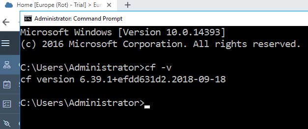

1. Now, login to SAP Cloud Platform cloud foundry environment with the command

	```
	cf login -a <YOUR_API_ENDPOINT> -u <YOUR_EMAIL>
	```
	where **\<YOUR\_API\_ENDPOINT\>** must be replaced with the endpoint URL you can get when you navigate in the cockpit to your subaccount and **\<YOUR\_EMAIL\>** with the email associated with your SAP Cloud Platform trial account  
	

1. Enter the password for your account
	>NOTE: The password will not be shown  

	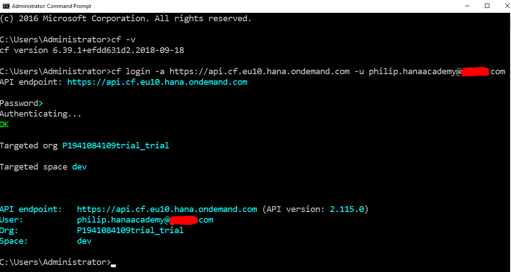

1.	Enter the command \`cf service\-key \<INSTANCE\_NAME\> \<SERVICE\_KEY\_NAME\>\` to display your service key and make sure that everything is available. If you have followed the naming convention we used in the previous exercise, your command should be

	```
	cf service-key ml ml-sk
	```

	You can copy this service key somewhere for your ease and comfort (e.g. Notepad++) because it will be needed later in the exercise  
	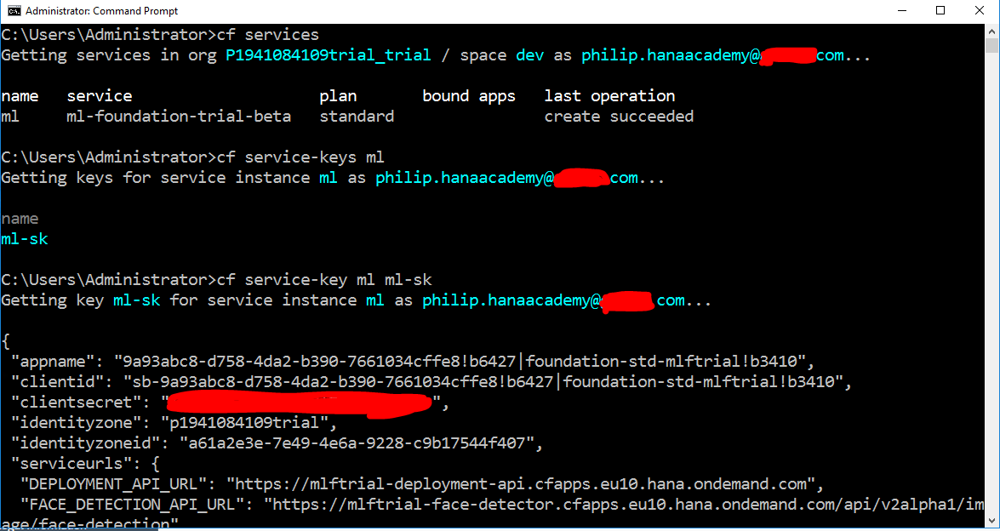

1. Let's check that the Cloud Foundry SAPML Plugin is installed. Details on how to install the SAPML CLI plugin are in the prerequisites to this workshop. Run the following command to get the list of all the installed plugins. You should see that SAPML is already installed  

	```
	cf plugins
	```
	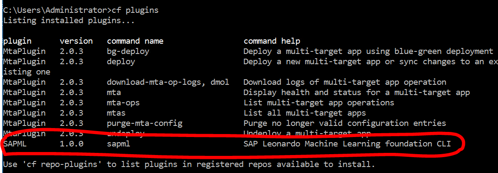

1. Enter the following command - you will see that some values are not set

	```
	cf sapml config get
	```
	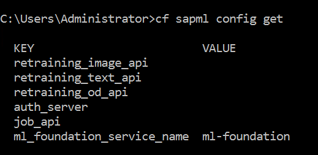

1. Set the correct values for your SAPML configuration using the following commands

```sh
cf sapml config set ml_foundation_service_name ml-foundation-trial-beta
cf sapml config set ml_foundation_service_name ml-foundation-trial-beta2
cf sapml config set ml_foundation_service_name ml-foundation-trial-beta3
cf sapml config set auth_server <url>
cf sapml config set job_api <JOB_SUBMISSION_API_URL>
cf sapml config set retraining_image_api <IMAGE_RETRAIN_API_URL>
```

1. When done, enter to check that everything is set correctly

	```
	cf sapml config get
	```
	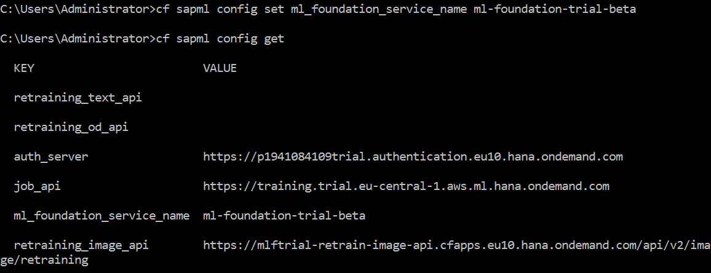

1. Initialize the cloud filesystem with the command

	```
	cf sapml fs init
	```
	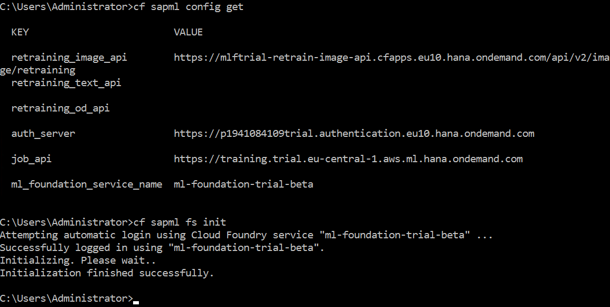

1. List the root directory with the command - nothing should be displayed and we will now upload some retraining data

	```
	cf sapml fs list
	```


### <a name="upload-training-data"></a>Upload training data

1. Display the filesystem configuration with the command

	```
	cf sapml fs config
	```
	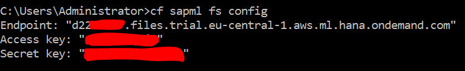

1. Using Minio client (details on how to install Minio client are in the prerequisites to this workshop) configure the remote host using the commands below (you need to take the missing values in the "<>" brackets from the filesystem configuration)

	```
	mc config host add saps3 https://<Endpoint> <Access key> <Secret key>
	```
	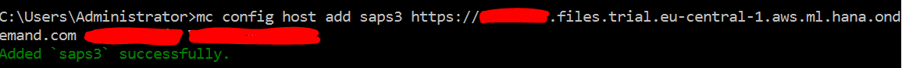

1. Using Windows Explorer navigate to the folder where the retraining data file *Image-Classification-Retrain-Brands.zip* was downloaded previously and extract it via *Extract All* or using a tool like *7-zip*
  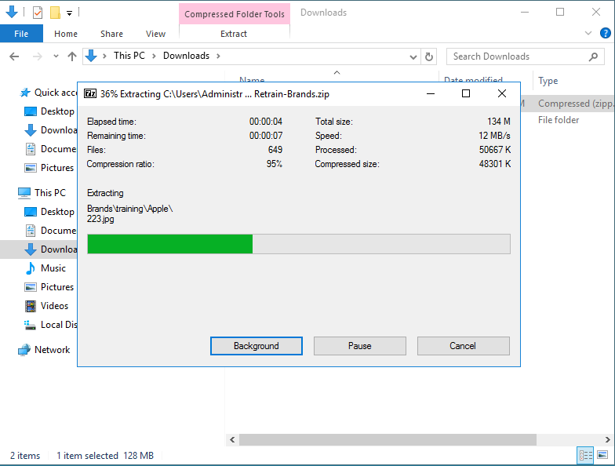

1. Observe the folder structure - training, test and validation with each of these having a subfolder for each classification value and images in the respective subfolders. Source data is split 80-10-10 (80% training, 10% test and 10% validation)
  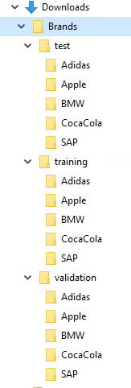

1. From the command prompt, navigate to the folder where the Brands data was extracted

	```
	cd downloads
	```

1. Copy the data to your AWS S3 bucket using Minio client - this will take a minute or two

  ```
  mc cp Brands saps3/data --recursive
  ```
  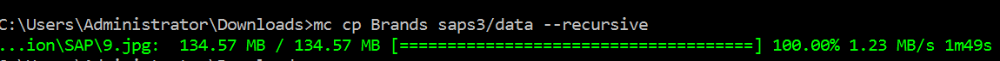

1. List the Brands directory

  ```
  cf sapml fs list Brands/
  ```

1. Display the training categories

	```
	cf sapml fs list Brands/training/
	```
	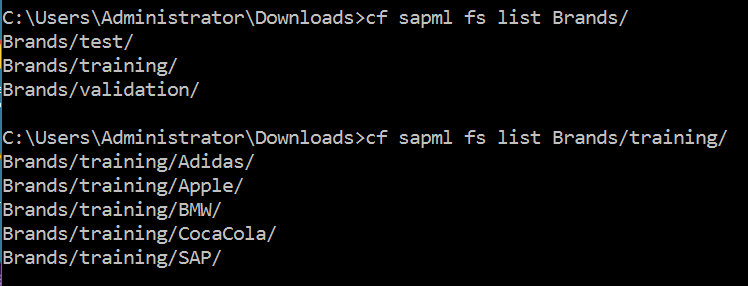


### <a name="retrain-model"></a>Retrain the model

1. You need now to prepare a configuration file for retraining. Open your favorite text editor (e.g. Notepad++) and create a new file named *retrain.json* in the current folder

1. Copy the text below and paste it into this new file  

	```json
	{
  		"dataset": "Brands",
  		"modelName": "brands-01",
  		"learningRate": 0.001
	}
	```
	Let me give you a bit of explanation about the content of this file. You need to specify the data set name and a model name. As our folder structure has the root name "Brands", we choose the value "Brands" for our dataset. Give it a new model name of your choice and save it (e.g. "brands-01"). You can add optional retrain parameters (e.g. learning rate). Once finished editing, remember to **save** the file  
	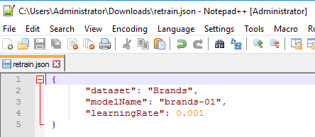

1. Start the retrain process using the SAPML CLI command

	```
	cf sapml retraining job_submit retrain.json -m image
	```
	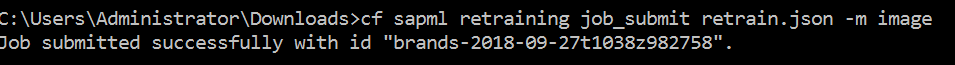

1. Check the job status: it could be PENDING  

	```
	cf sapml retraining jobs -m image
	```
	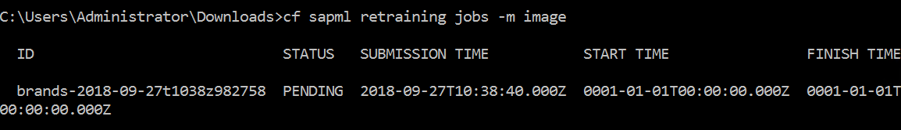

1. After a while your job should finish successfully: be patient, it might take some time  
	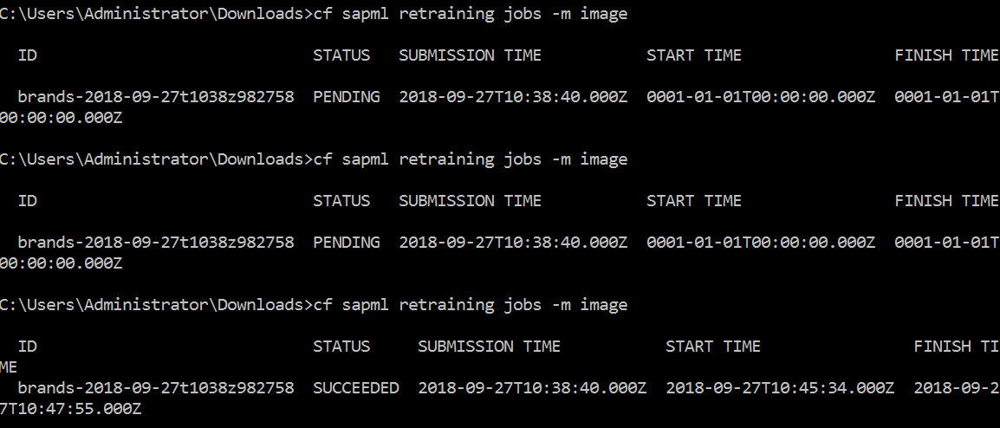

1. List the directory to get the name of the executed job

	```
	cf sapml fs list
	```
	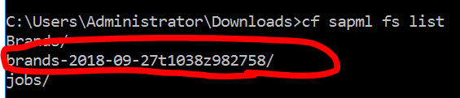

1. Download the retrain log *retraining.log* by specifying the job name in the remote path and the local path where you want to put the downloaded log

	```
	cf sapml fs get <REMOTE_PATH>retraining.log <LOCAL_PATH>retraining.log
	```
	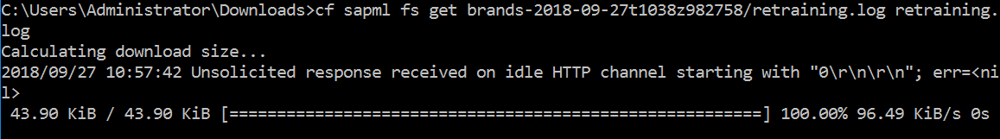

1. View the retrain log by opening it with your favorite text editor. **Take note of the version number at the bottom of the log (in your case it should be 1)**. This version is incremented for every retrain run when using the same model name. The model name is the "brands-01" string you have previously specified in the *retrain.json* file
	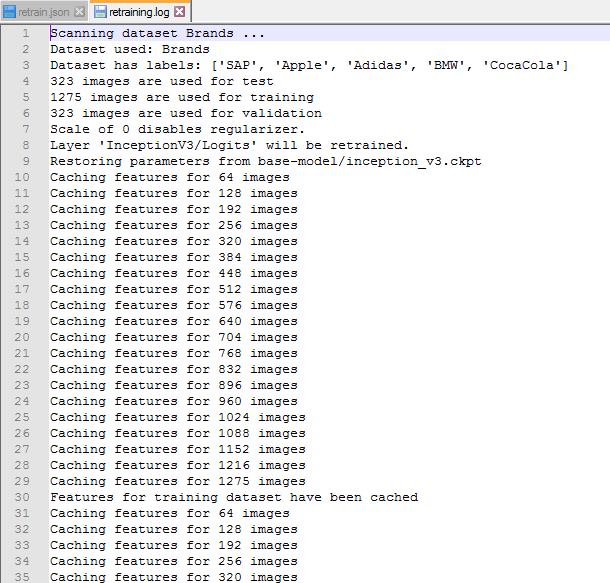
	


### <a name="deploy-retrained-model"></a>Deploy the retrained model

1. Deploy the retrained model by specifying the model name and version

	```
	cf sapml retraining model_deploy <MODEL_NAME> <MODEL_VERSION_NUMBER> -m image
	```
	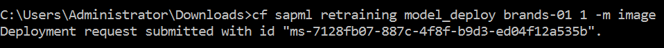

1. Check the deployment status: it takes a couple of minutes until the model container with the retrained model is up and running. At the end of the process you should get a deployment status "SUCCEEDED" message.

	```
	cf sapml retraining model_deployments -m image
	```
	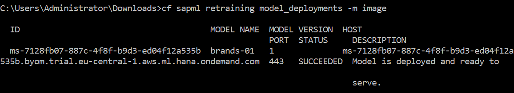


### <a name="test-retrained-model"></a> Test the retrained model
In order to test the retrained model you need to open the SAPUI5 application you have already used in the previous exercise. This application must be modified a little bit in order to produce the expected results.

1. Go back to the **Neo Trial** in SAP Cloud Platform cockpit and navigate to **Connectivity** then **Destinations** and click on **Clone** for the destination **sapui5ml-api**
	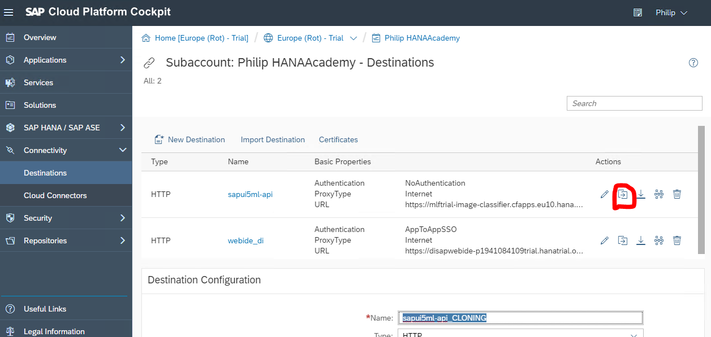

1. Change the name to **retraining** and press the **Save** button
	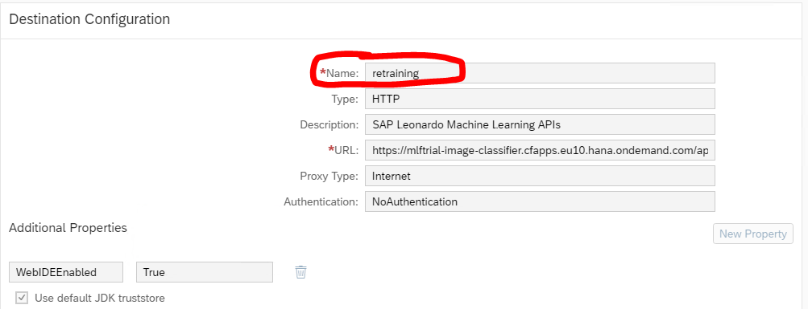

1. Open SAP Web IDE Full-Stack with the SAPUI5 application you have already used in the previous exercise, and edit the *settings.json* file by adding the following code

	```json
	, {
			"name": "Retrained Image Classifier",
			"url": "/retraining/image/classification/models/<your_model_name>/versions/<version>",
			"headers": {
				"Authorization": "<<<< YOUR BEARER TOKEN >>>>"
			}
		}
	```
	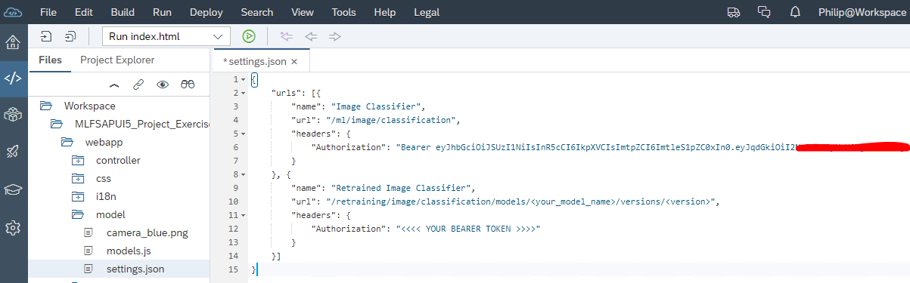

1. If it's less than 12 hours since you last created an access token you can copy and paste the **Authorization** from the example above. Otherwise go back to Postman and re-create your access token and paste it into both **Authorization** items. You also need to set the **model name** and **version** values to match your retrained model. Finally **Save** your changes
	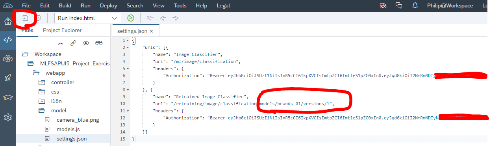

1. Run the application by clicking on the green *Run* button in the toolbar and test the images contained in the [RetrainImages.zip](files/RetrainImages.zip?raw=true) directly on the blue camera icon. You should be able to see a new column containing the results of the classification based on the retrained model and appreciate the improvement in accuracy using the retrained model. For example, take *BMW.jpg*
	

1. Congratulations! You have successfully retrained, deployed and tested the Image Classification model


### <a name="test-retrained-model-postman"></a> Test the retrained model with Postman
It's also possible to perform inference via Postman - this way you can understand the exact API calls that are necessary

1. Open a new tab in **Chrome** and open **Postman** from the **Apps** menu and open a new tab
	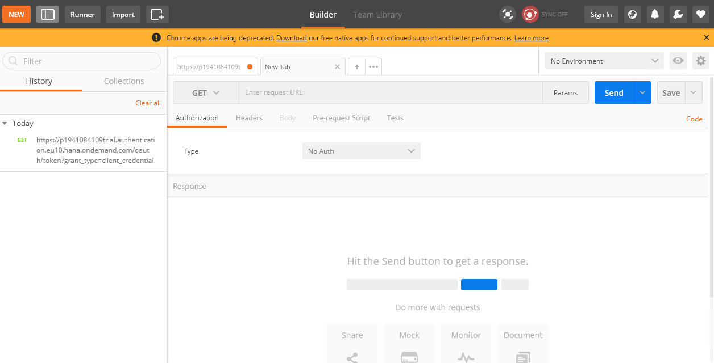

1. Set the method to **POST** and paste in your service key **IMAGE_CLASSIFICATION_URL** as request url (HINT: you can use the cf service-key command or the Cloud Foundry cockpit to view your service key)
	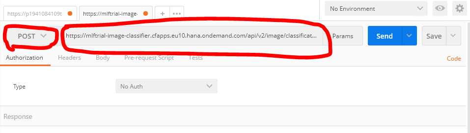

1. Select the **Headers** tab, add **Authorization** and paste your access token prefixed by **Bearer** and a space
  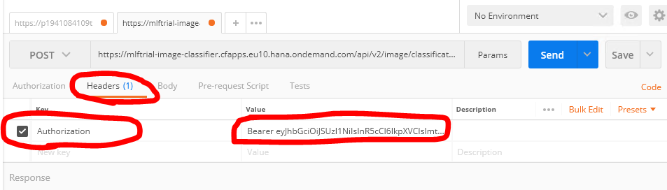

1. Select the **Body** tab, add **files** and press the **Choose Files** button to select an image file (or a zip file containing multiple images)
  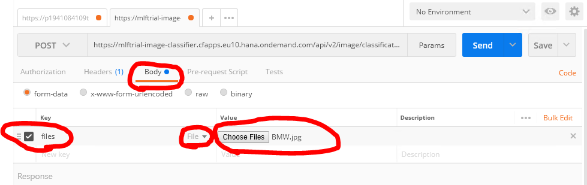

1. Press the **Send** button to send the request and the results will be displayed - we are using the standard pre-trained model here so results are not optimal!
	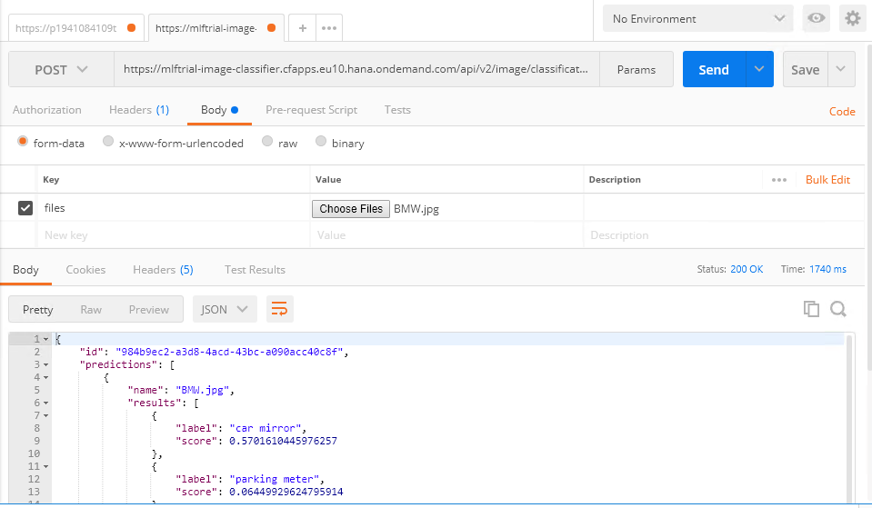

1. Let's change to the model we re-trained and deployed earlier. At the end of the request URL add **/models/<your_model_name>/versions/<version>** where you substitute your model name and version
	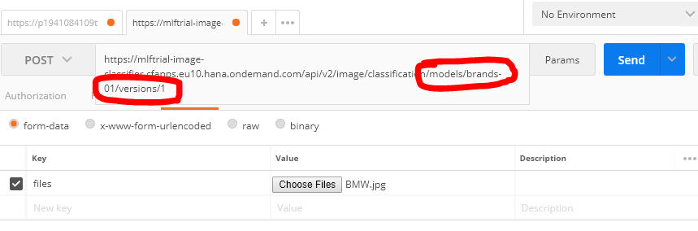

1. Press the **Send** button to send the request and the results will be displayed - inference is much improved with the retrained model! You can repeat this for other images and examine the results
	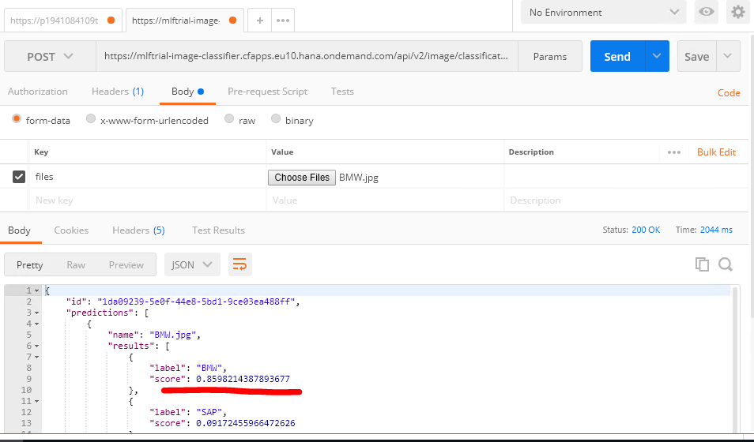

1. Congratulations! You have successfully tested the Image Classification model from Postman


## Summary
You have completed the exercise!

You are now able to:

-	Login to SAP CF using the SAP CF CLI
-	Upload the training data using Minio client
-	Perform retraining process using the SAPML CLI
-	Deploy the retrained model using the SAPML CLI
-	Use the deployed retrained model for inference (with a prepared SAPUI5 app)
-	Use the deployed retrained model for inference (with Postman)

Please proceed with next exercise.
