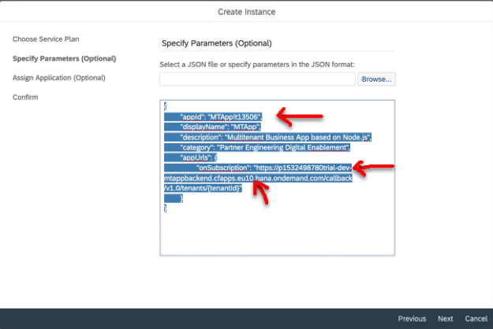
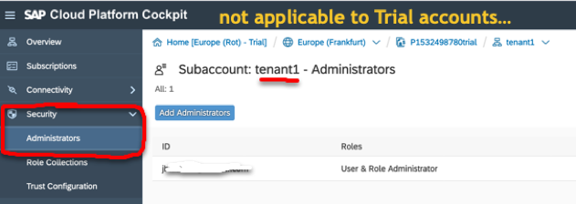

<table width=100% border=>
<tr><td colspan=2> </td></tr>
<tr><td colspan=2><h1>Exercise for Multitenant Applications in SCP CF Trial -- An introduction </h1></td></tr>
<tr><td><h3>SAP Partner Workshop</h3></td><td><h1> &nbsp;60 min</h1></td></tr>
</table>

## Description
This course provides an introduction to the concept of building applications in a multitenant landscape. It is the first in a series of topics covering multitenancy concepts and design implications for routing applications across tenants. This exercise will look at the configuration steps within Cloud Foundry for developing and routing multitenant applications.

For more information about Multiltenancy in general, you might visit:

* help.sap.com/cp documentation on [developing multitenant applications in Cloud Foundry](
https://help.sap.com/viewer/65de2977205c403bbc107264b8eccf4b/Cloud/en-US/5e8a2b74e4f2442b8257c850ed912f48.html)
* blogs on definition and architecture of multitenancy in Cloud Foundry <https://blogs.sap.com/2018/09/26/multitenancy-architecture-on-sap-cloud-platform-cloud-foundry-environment/>

In this exercise, you’ll learn how to ...

* Understand basics of multitenant applications
* Develop and Deploy a multitenant application from a sample project
* Register the application with the SaaS Provisioning service
* Onboard/Subscribe consumers to the application
* Offboard/Unsubscribe consumers to the application

## Target group

* Developers
* People interested in Multitenant Business Applications

## Goal

The goal of this exercise is to understand how to develop applications in a multitenant environment in order to take advantage of tenant isolation and resource optimizations inherent in multitenancy. 

## Outcomes

1. [Getting Started](#linkcode1)
2. [Develop and Deploy Multitenant Application](#linkcode2)
3. [Register as a Multitenant Application](#linkcode3)
4. [Subscribing or Onboarding consumer tenants](#linkcode4)
5. [Unsubscribing or Offboarding consumer tenants](#linkcode5)

###  Getting Started
Multitenancy in the SAP Cloud Platform allows you, the application provider, to create multiple separate tenants (consumers) for your application and share your application across these tenants simultaneously.  Each consumer has a dedicated URL to their tenant, yet they can share application resources across tenants to improve efficiency and provide a single upgrade step for development modifications.

In this exercise, we will look at getting started with multitenant applcation development using the SCP Trial system. We will identify resources available for understanding the concepts of multitenancy, as well as configure our Cloud Foundry environment for developing a multitenant application.

##### Step 1 - Review Documentation regarding Multitenancy
For a quick understanding of how the architecture works, let's take a look at the [Help](https://help.sap.com/viewer/65de2977205c403bbc107264b8eccf4b/Cloud/en-US/5e8a2b74e4f2442b8257c850ed912f48.html) file.  Here we can see the steps involved with developing a multitenant application, deploying it to the Provider subaccount, then configuring the approuter and binding the application, establishing the appropriate authorization / authentication services and finally registering the provisioning service so that the various consumer subaccounts (tenants) may subscribe to the main multitenant business application.  

We will take a look at all of these steps in this exercise.

##### Step 2 - Log On to your SCP Trial account
For this part of the exercise, again we will be using the SCP Trial account to get started.  (The steps are very similiar if you are using a productive account.) If you do not have a Cloud Foundry trial account established already, please refer to the steps [here] (https://github.com/saphanaacademy/SCP_Onboarding/blob/master/Exercises/SCP_Exercises.md#-create-an-account-in-scp-trial-landscape) from the SCP Onboarding exercises.

##### Step 3 - Create a Provider Subaccount in Cloud Foundry
1. Open your Cloud Foundry trial account from your SCP Global Account page. If you need to create Cloud Foundry subaccount, select your region and click OK. (We will use Europe-Frankfurt).
2. If you already have a CF subaccount called "trial" (perhaps from the earlier SCP Onboarding exercise) then use that one.

##### Step4 - Enable your Web IDE development tool

3. We will also need to use a developer tool like Web IDE full stack. To activate that, you will need to have a Neo trial account available as well configure some authorizations.  To see how to set this up, review the steps [here](https://github.com/saphanaacademy/SCP_Onboarding/blob/master/Exercises/SCP_Exercises.md#step-1----open-the-webide-fullstack-service) from the SCP Onboarding series.

4. If you do not already have it open, go to the Web IDE service in your Neo subaccount and click **Go To Service** to load Web IDE.

5. It would be helpful to go ahead and Bookmark that link for use later, to save time going through all the menus.

##### Step 5 - Load the pre-configured project from GitHub

1. For this exercise, we have already created a sample project for you. To load it into your workspace, you can go to the *SAP HANA Academy GitHub site* <https://github.com/saphanaacademy>, click on the **Repositories** tab, then click to open the **MTApp** repository.

2. The easiest way to work with this is to click the **Clone or Download button**, then click the **Copy icon** to copy the URL for this project.

3. Then go into Web IDE to your Workspace, **Right-click** to choose **Git** and then **Clone Repository**

4. **Paste** the URL you copied from GitHub into the dialog box, then click **Clone**.

6. You can choose **Do it Later** to deal with the system files.

7. If the clone was successful, you should see our **MTApp** project added to your landscape.

##### Step 6 - Confirm Web IDE is pointing to this landscape

Our Web IDE full stack development environment could be pointing to any landsscape, so let's check our Preferences for Cloud Foundry and confirm our API Endpoint.

1. To do that, click on the **Preferences** (gear icon) from the left hand menu in Web IDE, then click on the **Workspace Preference** for **Cloud Foundry**, and you should see your current API endpoint.

2. If you don't see any endpoint, then you will need to configure for your Cloud Foundry endpoint for this subaccount. To review, those steps were covered [here](https://github.com/saphanaacademy/SCP_Onboarding/blob/master/Exercises/SCP_Exercises.md#step-2----configure-for-cloud-foundry)

3. If you have made any changes to the API Endpoint, click **Save**.

4. You may be prompted to **Log On** using your SAP Cloud Platform credentials.

##### Step 7 - Review the MTApp project

Now that we have our Cloud Foundry subaccount created, with our *'trial'* subaccount and *'dev'* space, and we have confirmed that our API Endpoint for our Web IDE project is the correct Cloud Foundry subaccount endpoint, we can start to develop our application. 

####  Develop and Deploy Multitenant Buisness Applications

Let's review what is in the project we just cloned. This application could have been written using Java or Node.js or python, but whatever language we use, there are some specific things we need to have in our application to make it work as a multitenant application. For instance we will need certain CallBacks that will be used during the onboarding and offboarding of tenant subscriptions to this provider account. We will look at those in this next section of the exercise.

##### Step 1 -  Review the mta.yaml file

If you recall, the ***mta.yaml*** file is where we can see all the various aspects of our project defined. **Right-Click** on the **mta.yaml** from our **MTApp** project in Web IDE, and choose to use the **Code Editor** to review the contents. 

##### Step 2 - Review the MTAppBackend folder

We have a **MTAppBackEnd** module which is where our main server-side technology will be. In this example, it is node.js express running a very simple *Hello World* type example to return information about who is logged on. 

1. If we open the **server.js** file, we see in the *app.get* function it is just returning some HTML with user info.

3. You will also see we are returning the **identityZone** parameter which is actually the subaccount ID for the multitenant application.

4. You will also see that we reference the **xsuaa** service which controls our authentication and authorization.

4. If we look at the **package.json** file, we see there are standard dependencies for express, SAP environment variables and security.

5. If we open the **xs-security.json** file from our Workspace we see the details of how we set up security, and there are some very important elements that must be included here.

6.  You must specify your **appname.Callback** as a Scope, and include **application, sap-provisioning, tenant-onboarding** in the scope authorization.  This allows us to do our onboarding and offboarding of tenants from the Cloud Platform cockpit.

7.  We can also confirm this setting in the **mta.yaml** file showing the resources for the MTAppUAA using the **xsuaa** service for our application - both for the BackEnd and the AppRouter.

##### Step 3 - Review the MTAppRouter folder

The approuter is essentially the entrance to the app from the public side. It will actually handle the authentication and authorization and then send the request to the BackEnd for processing.

1.  If we open the **xs-app.json** file in the **MTAppRouter** folder, we see our very simple example puts in a route that takes whatever comes in to the approuter and sends it directly to our backend.

##### Step 4 -- CallBacks for OnBoarding and OffBoarding

2. There are a couple of additional requirements we need to look at next. In the **MTAppBackEnd > server.js** file we need to specify, at the minimum, the two **CallBacks** for our application onboarding and offboarding actions to subscribe and unsubscribe tenants from our application.

2. For the Onboarding, it is an **app.put** call with the path **"/callback/v1.0/tenants/* "**. You can run whatever code you want, but at a minimum, you need to send back the unique URL for the application to be used for this consumer tenant. We can get that by looking at the **req.body.subscribed.Subdomain** that is provided to us by the cockpit or whatever has been calling this callback.

Another thing to notice is that in the *tenantAppURL* variable we are creating, we are also referencing the subaccount organization and space names, as well as the data center or landscape.

3. NOTE: in the video and the sample code, the example uses "Pxxxxtrial-trial" for an Organization name, so the command includes adding that '-trial' suffix. If you are building this exercise in an existing trial account where your Domain and Subdomain have been edited to be the same ie) without the '-trial' suffix, you will need to modify the code to remove that additional text string. If you chose something other than Europe-Frankfurt as your data center, you may need to adjust the Cloud Foundry endpoint reference as well.

3. For the OffBoarding, it will be an **app.delete** call and we can just send back a blank string with code 200 saying it was successful.

NOTE: for more detailed information on the requirements for these callbacks, you can refer to the <http://help.sap.com/cp> and look at */Development/Developing Multitenant Business Applications in the Cloud Foundry Environment* section.

5. One more thing to look at is the setting in the **mta.yaml** file for something very important.  For the Router application, there is a property called the **"TENANT_HOST_PATTERN"**. This is where we will decode the subaccount domain name from Cloud Foundry and map it to the route for the authentication to work correctly. This parameter  will also be pointing to the organization, space and endpoints for your Cloud Foundry subaccount for this exercise.  Again, check whether you need to remove the suffix "-trial" and whether the data center is correctly identified.

6. Remember to save any changes you have made to the files.

##### Step 8 - Build and Deploy the Application

Now that our callbacks are established and our routes and endpoints are verified, we can go ahead and build the application.

1. For the MTApp project level, **right-click** and choose **Build** then **Build** again.
 

2. When the build process completes, you should see the "Build Successful" message  and you will notice that you now have a **mta_archives** folder with an MTApp_0.0.1.mtar file in it. This Multi-target archive file is an archive of our whole project with all the dependencies in there, ready to be deployed.

3. **Right-click** on the **.mtar** file, choose **Deploy** and then **Depoly to SAP Cloud Platform**.

4. We would need to select our endpoint, organization and space to which to deploy the application. **Click Deploy**.

5. After a few minutes, you should see several messages indicating it deployed successfully with the MTApp project, MTAppBackend and MTAppRouter having been created.

##### Step 9 - Review the Deployed application

If we go back to our SCP cockpit, we can now take a look at the application we just deployed.

1. Go to your Cloud Foundry *trial* subaccount, open the *trial* organization and then notice that the *'dev'* space shows some services and routes allocated in the Quota.  If you were running a production environment, you may need to assign quotas, but for the trial we should be fine for this exercise as there are 4GB of Memory available.

2. Click to **open the 'dev' space** and notice you have a couple of applications started for the **MTAppRouter** and the **MTAppBackend**.

3. If we go to our **Service Instances**, we see that we have our **xsuaa** service which is providing our athentication and authorization service for this application. We also see that it is connected, or bound, to the MTAppRouter and MTAppBackend reference applications at runtime.

##### Step 10 - Test the Application

Next we can go ahead and test our application. We will test the MTAppRouter application because that is the frontend portion of our app.

1. Go back to the Applications area and **Click on the MTAppRouter application**. 

2. This will give us the URL for the provider subaccount application route. **Click the URL** to launch it.

3. You will be prompted to **Log On** with your SCP credentials

4. And you should see the response body showing your name, subdomain and Identity Zone from the MTAppRouter. This is important as it uniquely identifies the subdomain for that consumer tenant being used in the application.

5. We could actually confirm that information by going back to our Cloud Foundry trial subaccount, and **verifying the subaccount details for subdomain and ID.**

####  Register as a Multitenant Application

We have created and deployed our application, but before we can have consumers subscribe or unsubscribe to it, we will need to register this application as a multitenant application.

##### Step 1 - Find the unique application name in the service binding

There is a bit of information we will need to find about our application in order to complete the registry.

1. If we go to our space and **Click on the MTAppBackend** application this time, we will see the **xsuaa** service that we are using for our authorization.  If we click the **Show Sensitive Data** button, we see some of the details for our application security.

2. We want to scroll down through the values until we find the one for the **xsappname** which will have a value assigned. It is essentially the unique application used for authorization. **Copy that value**

##### Step 2 - Update our Registry file

3. We will use this information to update our **MTApp > registry-config.json** file in our MTApp project in Web IDE. We will actually make a couple of updates here:

Replace |  With
-----| ----
< xsappname > | the value from your service binding
< subdomain > | the subdomain of your subaccount
-trial | delete if your organization name does not use the suffix
eu10.hana.ondemand.com | if you are working in a different data center

4. Click **Save** to accept the changes.

5. We are going to **Copy that json code** (lines 1-9), and use it to essentially instantiate a new service.

##### Step 3 - Instantiate the Provisioning Service

1. From the SCP Cockpit, go to your *'dev'* space, and click the **Services** link from the left hand menu, then choose **Service Marketplace**.  Search for *prov* and you should find the **SaaS Provisioning** service. 

3. **Click to open the service**

4. Click **Instances** from the left hand menu, then click the **New Instance** button.

2. Click the **Application** service plan because this is a multitenant application.

3. In the **Specify Parameters** screen, we will **Paste** the json code from our MTApp > registry-config.json file we updated earlier. Remember we filled in our xsappname and our subdomain and verified our endpoint and datacenter were correct, and that  the callback syntax was in there.

4. Next we **Assign Application** by choosing the application we wish to bind to this registry, which is our **MTAppBackend** application.

5. We need to **give our registry a name**, we'll use *"MTAppRegistry"* and **Click Finish**.

6. Now we see our new SaaS Provisioning service instance called *"MTAppRegistry"*

We have now created and deployed our application and registered it as a multitenant app.  The next steps will be to look into onboarding (subscribing) and offboarding (unsubscribing) to our application.

####  Subscribing or Onboarding consumer tenants

Just to review.  In the first section of the exercise, we established our Global Account and created a Provider subaccount to host our application.  In the second section, we then created and deployed our multitenant business application and created our services for the backend application functionality and security handling, as well as the application routing operations. Finally, we registered the application for multitenancy using the SaaS provisioning service. 

The next steps will be to create the functionality to onboard or provision subscriber tenants for the consumers of our multitenant application.

##### Step 1 - Create our initial Consumer subaccount

First we will need to create at least one subaccount to be used for the subscription process.

1. Go to the **Global Account > subaccounts** list page in your SCP Cockpit. Here we see our current subaccount *'trial'* which is our provider account for our multitenant business application. 

2. **Copy your Pxxx account number** from the header as we will use that to in a minute.

3. Now we want to create a new subaccount by clicking the **New Subaccount** button.

2. For the display name we will want something unique so let's use ***tenant1***.

3. Next for the subdomain, this will need to be a unique value across the whole landscape, so we can **paste** in our Pxxx number followed by "tenant1" string to make that subdomain unique to my account and tenant.

4. **Click Create**

5. Once created, let's repeat those steps to **create a tenant2** (again with a unique subdomain)

6. If we click to open one of the new subaccounts, we will see the details for that subaccount.  

7. NOTE:  you do **not** need to Enable Cloud Foundry here even if it is running in a Cloud Foundry environment.  The consumer application is actually going to be running within your provider subaccount itself, so we just need this subaccount to allow the registration or subscription process to take place. 

##### Step 2 - [For information only] - Granting Roles to tenant subaccount

NOTE: We are working in the trial landscape and don't have the ability to assign or create users. In a production account where you have a specific customer that you want to grant access to the subaccount to subscribe or unsubscribe, you would want to go to **Security** area on the left hand menu and go to **Administrators** and give them the Administrator role to access that subacount.  
For the trial, we will just work with our existing user.

##### Step 3 - Work with Subscriptions

8. Next, we want to go to the **Subscriptions** area from the left hand menu to see the list of applications available for subscription. If you properly registered your **MTApp** earlier in this exercise, you should see it in the list.

9. In the details for that subscription (displayname, category, etc), we see all the information we provided in the *registry-config.json* file earlier in this exercise.

10. We can **Click to open the tile** to see the details. We see that we are not automatically subscribed, so we can use the **Subscribe** button to activate the subscription.

11. We see we are subscribed and we could click to **Go to Application**.  Now in this development environment there is another step we need to do to have this work, but we can see that it calls up a route to that unique URL for that tenant1.

12. In fact, the unique URL was established at runtime by our *'app.put'* callback in the onboarding portion of our **MTAppBackend > server.js** file, where we created the *tenantAppURL* variable in our MTApp project.
 

##### Step 4 - Create Route Availability
12. What we need to do is make sure that that route exists. Let's go back to our **'dev'** space and open the tile. (subaccount 'trial' > Spaces > 'dev')
 

13. Click to **Open the 'dev' space** details page and then go to the **Routes** area from the left hand menu.

14. You'll see there are several Routes already defined, including the MTAppRouter and MTAppBackend we established earlier. However, we need to **Create a New Route** for the specific URL we defined from the subscription to our application.
 

14. We will want to **copy the part of the tenant URL that defines the tenant subdomain and router to be used**. Essentially that is the part of the URL before the .cfapps.datacenter that includes our tenant subdomain, space and app router service.
 

15. For our New Route, the **Domain** will be your datacenter (for example eu10 in our example), and then you'll want to define the **Host Name** as the portion of the tenant URL you just copied, so **paste** that in now. 

16. Click **Save**

17. Once it is saved, we will need to **Map** it as it currently does not have any mapped applications. To do this, we will **Click the Link icon** on the right side of the new route we created.

18. We will want to map this to our **MTAppRouter**. Click **Save**

19. We can do the same thing for our tenant2 just by modifying the HostName URL to be tenant2. **Click New Route**, choose your datacenter, **paste in the URL** for the tenant** but modify it to be tenant**2** instead and click **Save**

20. And we will want to **Map** that to the **MTAppRouter** application, and click **Save**

##### Step 5 - Test Application

Now if we go back to our application, we should be able to run it as the route is defined.

1. Go back to your browser window and refresh the page. If you closed that browswer tab, you can simply click the **Launch that Route** icon on the right side of the tenant1 or tenant2 routes you just created.

2. You should be prompted to **Log On** using your SCP credentials to log on to this new tenant.

3. Once you log on, you should see the response body we created earlier that shows your name, unique subdomain for this tenant, and the ID or Identity Zone value.

4. Again, you could go to the subaccount details for that tenant and check that the details match to this message.

##### Step 6 - Subscribe the second tenant

If you created a tenant2, you will want to go into the **Subscriptions** area for that tenant2 subaccount and click **Subscribe**.

1. From the trial organization, **choose the tenant2 subaccount**, click the **Subscriptions** area of the left hand menu, choose the **MTApp** subscription tile, and click **Subscribe**.
 

2. This time if we click **Go to Application** it should work the first time, since we have already created the route and mapped it earlier.
 

3. Once again, we will be prompted to **Log On** to this tenant, and then we will see our message, with the subdomain and ID to our tenant2 instance.

4. [Optional] If you have another user ID that is known within the SAP ID service, you can try using those credentials to see how multiple users can access and run the same application, but with their own unique tenant and security.

We have seen how to onboard or subscribe different users to a multitenant business application. We saw how when they call the application, each one is given a different unique URL to call the application which is able to identify their own tenant subdomain within the application. 

####  Unsubscribing or Offboarding consumer tenants

Our last and final step in this series is to understand how to unsubscribe or offboard tenants.

In our last video, we subscribed two tenants to our multitenant application, tenant1 and tenant2. Let's now see how we can unsubscribe or offboard tenant2.

##### Step 1 - Unsubscribe from the application

1. If we go to the global account and open the subaccount for *'tenant2'* and go to the **Subscriptions** area, we can click to open the **MTApp** subscription and simply click the **Unsubscribe** button, then click **OK**

2. If you had granted the role to the user (for instance in a production account) to access SCP subaccount directly, then the user could log on and go to their subaccount and unsubscribe themselves.

##### Step 2 - Deactivate the Route

**NOTE:**  By unsubscribing we have disconnected the service (and we see that the "Go to Application" blink is greyed out), but the route itself still exists and can still be called directly. We will want to deactivate that route as well.

4. To deactivate the Route as well, we will need to open our main development subaccount 'trial' and open the 'dev' space, then choose **Routes** from the left hand menu.

5. Select the route for the *tenant2* and we can simply click the Trash icon to **Delete** that route.
 

6. Click **Delete** to confirm that this route is to be deleted.

7. We can confirm that it is deactivated by clicking on the MTAppRouter application in the mapped applications column, and see that we only have application routes for our development account 'trial' and our 'tenant1' URLs.

8. Alternatively, if you still have the browser page open for the tenant2 application and you try to refresh the page, it should fail.

9.  To be very thorough in your clean up, you could also go to the list of subaccounts and delete the subaccount for tenant2.

**PLEASE BE VERY CAREFUL HERE** If you delete the application or the provider subaccount without first unsubscribing all the tenants associated with it, you may end up with a critical error due to the SaaS registry still being active but having no associated accounts or any ability to deactivate the service.  Therefore, you should ***make sure to unsubscribe all tenants before deleting any associated application or provider subaccount.***

That completes our exercise in getting started with multitenant business applications.

## Summary
Congratulations!  You have learned how to create, deploy, and register a multitenant application, as well as subscribe and unsubscribe consumer tenants from that application.

If you wish to contnue learning about Multitenant Businsess Applications, please visit the [SAP HANA Acadmey YouTube channel playlist for Multitenant Applications](https://www.youtube.com/playlist?list=PLkzo92owKnVx3Sh0nemX8GoSNzJGfsWJM). We have covered videos 1-5 in the series for this exercise.

* Getting Started
* Develop and Deploy multitenant applications
* Register multitenant application using the SaaS Provisioning service
* Subscribe or Onboard tenants
* Unsubscribe or Offboard tenants

