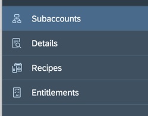

<table width=100% border=>
<tr><td colspan=2> </td></tr>
<tr><td colspan=2><h1>Exercise for SAP Enterprise Messaging -- An Introduction</h1></td></tr>
<tr><td><h3>SAP Partner Workshop</h3></td><td><h1> &nbsp;15 min</h1></td></tr>
</table>

## Description
This course provides an introduction to SAP Enterprise Messaging, which is a fully-managed, cloud-based messaging service allowing you to connect applications, services, and systems seamlessly across different technologies and platforms using decoupled, asynchronous communication. This messaging and event enabling service is available in the SAP Cloud Platform, Cloud Foundry environment.  For more information about Enterprise Messaging in general, you might visit:

* [SAP Help Portal] (https://help.sap.com/viewer/bf82e6b26456494cbdd197057c09979f/Cloud/en-US/df532e8735eb4322b00bfc7e42f84e8d.html?q=enterprise%20messaging)
* [SAP Cloud Platform website] (https://cloudplatform.sap.com/capabilities/product-info.SAP-Enterprise-Messaging.dc3dcc84-cd9c-477c-ba1c-862340abd874.html)
* [SAP.com website] (https://www.sap.com/community/topics/enterprise-messaging.html)

In this exercise, you’ll learn how to ...

* Overview of Enterprise Messaging as a service
* Create a Trial account and Service Instance
* Configure Authorizations & Roles
* Create a Queue and Queue Subscription to a Topic

## Target group

* Developers
* People interested in learning about SAP Enterprise Messaging 

## Goal

The goal of this exercise is to understand how Enterrise Messaging is used to handle messages between applications, and to walk through the steps to create an initial Enterprise Messaging service and set up message queues and subscriptions. 

## Outcomes

1. [About Enterprise Messaging]
(#linkcode1)
2. [Setting Up Your Trial Instance](#linkcode2)
3. [Setting Up the Enterprise Messaging Application](#linkcode3)
4. [Creating the Service Instance](#linkcode4)
5. [Accessing the Dashboard to Create Queues and Subscriptions](#linkcode5)

###  About Enterprise Messaging

In this exercise, we will look at SAP Enterprise Messaging services to create asynchronous communication which allow you to send and receive between applications and services using standard protocols like MQTT and AMQP. You can also build applications and extensions that react to events from S/4HANA Cloud.

##### Step 1 - Review Regions and Services
1.  In our first step, let's take a look at where the Enterprise Messaging services are available. From your web browser, go the [SAP Help portal for Cloud Platform](http://help.sap.com/cp), then choose the **Regions and Services** link.

2. Next, let's scroll down and use the **Search** box to search for Enterprise Messaging. We see that it is offered in the Cloud Foundry environments, currently running on AWS only. For these exercises, we will be using the services that are offered in the free SCP Trial account.
3. If you click on the Service Name **"Enterprise Messaging"**, you can go directly to the documentation for that service. It is a good idea to go ahead and bookmark that page.

##### Step 2 - Review Documentation and Concepts
1. From the documentation, we can open the **Messaging Concepts** link, and we can see that we have the ability to organize our messaging for app-to-app communication in several ways -- using either Queues or Topics.
 
2. A **Queue** might be used for sending a message from S/4HANA (App A) to the queue, then you have a consumer application (App B) that will receive that message from the queue.

 
3. A **Topic** might be used for sending a message on a specific topic, that then can be read by multiple consumer applications (App B and App C) that will read that topic. Its important to note that the consumer applications must be up and running to receive that message topic since no topics are kept by the host.

4. For this example, we will actually use the best practice of using a combination of Topics and Queues by creating a **Queue Subscription**. How this works is that your application would send a Topic and then you would have your queue subscribe to different topics that would then be consumed by the different consumer applications connecting to that queue. In this way, if your consumer application is offline or inactive, the message would still be stored in the queue, ready to receive once the application is back online. Generally, you would establish one queue for each consuming application.

5. For the protocols used, if you have a sending application like S/4HANA cloud then the message into Enterprise Messaging might use MQTT protocol. Then for the consuming application receiving the message from Enterprise Messaging, you would use something like AMQP which is well-suited for an intra-Cloud Foundry environment.

####  Setting Up Your Instance

For this exercise we will go ahead and use the SCP Trial account available to us. If you have not estblished a Trial Account for SAP Cloud Platform, please follow the steps in Step 1a.  If you have a Trial available already, please skip to the Step 1b section and Log On.

##### Step 1a - Register for a Trial New Cloud Account
1.  If you do *not* already have an account in SCP, please visit the SAP Cloud Platform portal <https://cloudplatform.sap.com/try.html> and click on the "**Sign up for your free account**" link
2.  Fill in the information on the form, check the box that you have read the Terms & Conditions, then click **Submit** 
3. Once submitted, you will receive an email to the address you provided in the registration. Click the **Click to Activate your Account** button
4. Next, you should see your SCP Trial Account Cockpit

#####Step 1b - Log On to your Trial Account
1. If you already have a SCP Trial account, you can go to your saved link, or use SAP Cloud Platform portal <https://cloudplatform.sap.com/try.html> and click "**Log On**"
2. Next, you should see your SCP Trial Account Cockpit

#####Step 2 -  Set up your Cloud Foundry Dev Space
1. Once you log on to your trial account, go ahead and click to open the Cloud Foundry Trial. Remember that our Enterprise Messaging services were only offered in a few data centers, but the Trial datacenter of **Europe (Frankfurt)** was listed as one of the options, so we will click **OK**. 

2. The system will now process that request and set up the organization and configure Cloud Foundry for you. 

  *NOTE: If you are using a Productive system instead, you would need to do this configuration yourself.  Those steps are covered in the ["Developer Onboarding to SCP"] (https://www.youtube.com/watch?v=K0BD6eYys28&list=PLkzo92owKnVw3l4fqcLoQalyFi9K4-UdY) video series on the SAP HANA Academy.*

3. Once the request is processed, click **Go to Space**

#####Step 3 - Check Entitlements
Once our space is created, we want to go to that subaccount and look at the Entitlements for that space.

1. From the breadcrumb at the top, click on the **global account** link  to open the global account context menu on the left.
2. Click on the **Entitlements** section to see the assignments for this subaccount.

3. Scroll down and confirm that the Enterprise Messaging service has an assignment for the trial -- this should be automiatically done for a trial account. Again, if you are using a Productive account for this exercise, you would need to Edit and create this assignment manually.

4. Next, let's go into our subaccount, by clicking **Subaccounts** on the left hand menu, and click to open our **trial**.

 

####  Configuring the Enterprise Messaging Application
Next, we will want to subscribe to the appliaction that is part of the Enterprise Messaging service.

#####Step 1 - Subscribe to the Enterprise Messaging application

1. From within our trial subaccount, we will open the **Subscriptions** option from the left hand menu.

1. Here we see a list of available applications, and you should see one for Enterprise Messaging - which is currently Not Subscribed. Click on the **Enterprise Messaging tile**

2. Next, you will want to click on the **Subscribe** button.
 
 
3. After a second or so, you should see it changed to Subscribed.

#####Step 2 - Set up Authorizations to Enterprise Messaging Application
Next we will set up some authorizations for accessing the new application we are now subscribed to.

1. Go back to the Trial Subaccount from the bread crumb link at the top
 
 
2. From there, choose **Security** from the left hand menu, and choose the **Role Collections** option.

 
 
3. We will create a **New Role Collection** with rights to manage and develop this application.
 
4. Next, we will give it a name -- let's call it **EMManage** and click **Save**
 
5. Next, we will click to open that new **EMManage** role collection and begin to add the roles we need.
 
6. Click to **Add Role** and select ***xbem-app-!t2436*** for Enterprise Messaging from the drop down.  
7. For Role Template, we see there are several roles you can choose -- perhaps a Developer might just need Read Only, but for the Admin who is setting things up, we will choose **ManageRole** as it includes all the other roles as well.  Click **Save** to save our settings.
 
 
8. You should now see that "xbem..." application identifier in the list, with the ManageRole Role Name and template.
 
 
9. Next, we can go back to the trial account, click on Security again and this time choose the **Trust Configuration** option from the left hand menu.
 
 
10. We are going to click to select the **SAP ID Service** in this exercise.  (You may be using a different ID Service in your productive account)
 
11. Next we will assign that role to this ID Configuration.
12. Enter your User **email address** you used to log into SCP Trial. Next, you can click the **Show Assignments** button to see what assignmnets already exist for that user.  If you need to, cick **Add User** to add this user to the ID service trust configuration. 
 
13. Next we will go ahead and click the **Assign Role Collection** button and choose the **EMManage** role collection we just created in a previous step, and click the **Assign Role Collection** button
 

#####Step 3 - Go to Enterprise Messaging Application 
Now that we have our authorizations created and roles assigned, let's go to our Enterprise Messaging application we subscribed to earlier.

1.  From the trial subaccount, go back to the list of **Subscriptions** and click the **Go To Application** link on the Enterprise Message tile.
 
 
2. We will need to **Log In** using that user that we just authorized.
 

NOTE: you may see this intermediate screen telling you to set up the Enterprise Messaging Service Instance. We will do those steps next. (This was not shown in the video). 
 
 
For now, you might want to **bookmark this application page** so we can come back to it.  

###  Create the Service Instance
 
#####Step 1 - Create A Service Instance 
Next we will need to create a service instance for our Enterprise Messaging service.

1. Go back to the trial subaccount and open up your Dev Space (or whatever space you have created and given quota to allow you to create instances), click on the **Services** option in the left hand menu, and then choose the **Service Marketplace** option.
 
 *NOTE: If you are using a brand new Trial accunt, you may not have configured your Dev space yet. Those steps are covered in the ["Developer Onboarding to SCP"] (https://github.com/saphanaacademy/SCP_Onboarding#sap-cloud-platform---getting-started) exercises, or in the [SAP HANA Academy] (https://www.youtube.com/watch?v=K0BD6eYys28&list=PLkzo92owKnVw3l4fqcLoQalyFi9K4-UdY) video series on YouTube.*

2. If we have the quota assigned, we should see Enterprise Messaging in the list of services available. Click on the tile to **open the service**. 
 

3. Then click **Instances** from the left hand menu and choose **New Instance**
 
4. We will accept the Dev service plan (its the only one we have at the moment), so click **Next**
5. Next we will need to establish some parameters in JSON format.  The easiest way to do that is to go the documentation and copy the sample code from the "Create an Enterprise Messaging Service Instance" section. [(link to code)] (https://help.sap.com/viewer/bf82e6b26456494cbdd197057c09979f/Cloud/en-US/d0483a9e38434f23a4579d6fcc72654b.html)
 
6. So we can copy the code from the documentation, and then paste it into our input box and update the parameters for our instance.

Variable | Description
----| ----
emname| name of your service being created. **We'll just use "em"**  -- (please remember what you use!)
management:true | determines if you want the REST API available for management actions
messaingrest:true | determines if the REST API is available for messaging

We will leave both set to true for now.
 

7. Click **Next** to save our code parameters.
8. We don't have an application to assign yet, so just click **Next** again.
9. You need to give the instance a name, so use the same name you specified in the JSON code. We called it **"em"**.
10. Click **Finish**

#####Step 6 - Create A Service Key for Accessing our Instance
Now that we have created our service instance, the next thing we will want to do is to create a Service Key to allow us to access our instance.

1. Click to open the "em" instance you just created.
 
2. Click on Service Keys from the left hand menu, then click **Create Service Key** button to create our key.
 
3. Give your key a name, we will use **em-sk** for EM Service Key. Click **Save**
  
4. You will see that the system has generated some code, let's go ahead and **copy and paste** that whole section into a text editor and save as **"em.json"** so it knows it is JSON format as we will use bits of this code later.
  

###  Use the Dashboard to Create Queues and Queue  Subscriptions

#####Step 1 - Open the Dashboard
1. Let's go back to our Enterprise Messaging service environment again using the link from the breadcrumb menu at the top.
  
2. Now we should see that we have an additional icon on the screen for the Dashboard for this service. This link is very important as it gives you access to do quite a lot of configuration and setup.
 
3. Click the icon and **Open the Dashboard**

4. The first time, you may need to click to authorize this dashboard access. Click **Authorize**

5.Now we can see that Messaging Adminstration cockpit again and we see from the left hand menu that we now have access to Queues and Queue Subscriptions, etc. Currently it is an empty system, so let's create a queue.
  
 
#####Step 2 - Create a Queue

1. Click on **Queues** and click **Create**.
  
 
2. Give your queue a name, we'll call it **"queue1"** and click **Create**.
  
 
3. We see that the queue has been created, but there are currently messages in there.
4. Next, we want to create a **Queue Subscription**. We can choose that option from our left hand menu, then click **Create**. Here we will choose the queue to be subscribed to as the "queue1" we just created, and then give our topic or pattern a name. Let's use **"topic1"** and click **Create**. 

*NOTE: if you receive an error that no queues are available for subscription, you may need to refresh your browser.*

This says that when topic1 messages are received, they will be put into queue1. Then I can tell my consumer application to receive the messages from queue1, and they will be stored for later access if the application is offline. You can use the **Refresh** icon in the upper right to see the messages appearing in the queue, if available.

NOTE:  It is possible to do a lot of the steps we covered in this exercise using the Command Line Interface or CLI for Cloud Foundry -- creating instances, service keys, etc. Also, the REST APIs for management (if enabled) could be used for creating the queues and queue subscriptions.

## Summary
This concludes this exercise. You should have learned how to

* Create an Instance
* Assign Authorizations
* Subscribe to the Enterprise Messaging service application
* Create Queues and Queue Subscriptions

Please proceed with next exercise.
