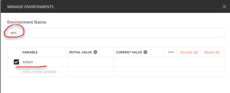
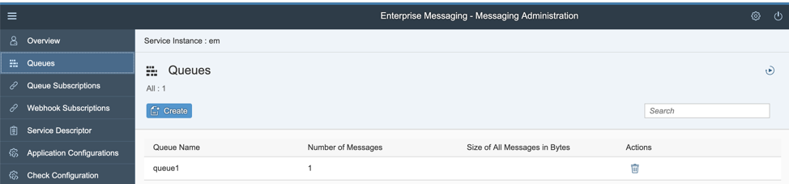

<table width=100% border=>
<tr><td colspan=2></td></tr>
<tr><td colspan=2><h1>Exercise 2 for SAP Enterprise Messaging -- Using Restful APIs</h1></td></tr>
<tr><td><h3>SAP Partner Workshop</h3></td><td><h1> &nbsp;15 min</h1></td></tr>
</table>

## Description
This course provides an introduction to SAP Enterprise Messaging, which is a fully-managed, cloud-based messaging service allowing you to connect applications, services, and systems seamlessly across different technologies and platforms using decoupled, asynchronous communication. This messaging and event enabling service is available in the SAP Cloud Platform, Cloud Foundry environment.  For more information about Enterprise Messaging in general, you might visit:

* [SAP Help Portal] (https://help.sap.com/viewer/bf82e6b26456494cbdd197057c09979f/Cloud/en-US/df532e8735eb4322b00bfc7e42f84e8d.html?q=enterprise%20messaging)
* [SAP Cloud Platform website] (https://cloudplatform.sap.com/capabilities/product-info.SAP-Enterprise-Messaging.dc3dcc84-cd9c-477c-ba1c-862340abd874.html)
* [SAP.com website] (https://www.sap.com/community/topics/enterprise-messaging.html)

In this exercise, you’ll learn how to ...

* Use REST APIs to create, test and manage Enterprise Messages between applications

## Target group

* Developers
* People interested in working with SAP Enterprise Messaging via REST APIs

## Goal

The goal of this exercise is to understand how Enterprise Messaging is used to handle messages between applications, and to walk through the steps to create an initial Enterprise Messaging service and test message queues and subscriptions via Restful APIs 

## Outcomes

1. [About REST APIs for Enterprise Messaging]
(#linkcode1)
2. [Using Postman to Test APIs](#linkcode2)
3. [Establishing Authorizations](#linkcode3)
4. [Using the Management API](#linkcode4)
5. [Using the Messages API](#linkcode5)

###  About REST APIs for Enterprise Messaging

In this exercise, we will look at SAP Enterprise Messaging services to create asynchronous communication which allow you to send and receive between applications and services using standard protocols like MQTT and AMQP. You can also build applications and extensions that react to events from S/4HANA Cloud.

NOTE: This exercise is built upon steps completed in the previous "Introduction to SAP Enterprise Messaging" example. Please make sure you have completed those steps before beginning this exercise.

##### Step 1 - Review API Documentation
1.  In our first step, let's take a look at the documentation surrounding using REST APIs for sending and receiving Enterprise Messages. From your web browser, go the SAP Help portal for Cloud Platform (http://help.sap.com/cp), then **Search** for [What is SAP Enterprise Messaging] (https://help.sap.com/viewer/bf82e6b26456494cbdd197057c09979f/Cloud/en-US/df532e8735eb4322b00bfc7e42f84e8d.html), and click on the **API Documentation** link.

You will see there are REST APIs for Sending and Receiving Messages, as well as REST APIs for Managing Queues and Subscriptions. We will use both of those in our example.

##### Step 2 - Review REST API for Send and Receive
1. From the documentation, we can open the **API for Send and Receive Messages** link, and we can see that we need to have a configured Service Instance and a Service Key, both of which we covered in the previous exercise.

2. If we click on the [API link] (https://help.sap.com/doc/3dfdf81b17b744ea921ce7ad464d1bd7/Cloud/en-US/messagingrest-api-spec.html), we can see all the information regarding that API -- like the various endpoints for POST or GET calls.

###  Using Postman

##### Step 1 - Configure Postman
To test these calls, we will use the Postman REST Client. If you do not already have it installed, you can go to [getpostman.com] (https://www.getpostman.com/downloads/) and click to **Download** the client for your operating system.
 

4. Once downloaded, go ahead and install it. You can skip Signing In and just go straight to the app.

##### Step 2 - Create Environment

To make it easy to use, we are going to **Add Environment** which we can choose from this popup screen, 

or if you have closed it or disabled it in your version, you can get to the Environments by clicking the "Environment Quick Look" icon  in the upper right corner of the screen.
 
6. Next, we will go ahead an add our environment.  Let's give it a name, **"em"** is fine, and we also want to set up one variable for **"token"** which we will use for authentication. 
  
 
7. Click **Add** to save those changes and then just close the popup window with the "X".

 

8. Next, we want to go to the Environemnts drop down and select to work with that environment we just created.
 

###  Establishing OAuth2 Authorization

This step is very similar if you have done this with other software.

##### Step 1 -- Establish our API endpoint

First thing we need to do is establish an Endpoint for our APIs. We will do this by copying some information from the Service Key code we copied to a text file in the previous exercise.

1. If you open that file, you will see there are tokenendpoint parameters for the managmenet and messaging APIs.  Let's go ahead and **copy the endpoint for Management**
  
2. And Paste that into Postman as our URL, and change the type of call to POST
  
3. Next, we will need some additional URL parameters that we can find back in the documentation file. We will **Copy** the line #3 in the procedure to append ***"?grant_type=client_credentials&response_type=token "***
 
to the end of our endpoint in Postman.
 

##### Step 2 - Establish Authorizations
Next we will need to authenticate, so let's click on **Authorization** in our Postman setup, and we will choose the **Basic** authorization type from the dropdown.
 

5. Next, we will need a user and password, which we will get from the text file of our Secret Key again. Here we can use the credentials from the management role and paste those into the form:
 

Field | Value
-----| -----
User | **Client ID** string
Password | **Client Secret** string

 

##### Step 3 - Create access token
Next we will also want to take that token parameter that we created earlier and put it into our environment. We can do this in the **Tests** area of Postman and copy/paste the following code:
***pm.environment.set("token","Bearer "+JSON.parse(responseBody).access_token);***

*(Note the space after the word Bearer within the quotes)*

 
This will automatically populate our variable for token.

7. Click **Send** to send the POST call, and then scroll down and you should see the response code 200 for success, as well as see the access_token created.

8. If we go to our Environment Quick Look  again, we should see we now have token value of "Bearer xxx" where the xxx is the parsed JSON from our access_token variable.

Now if we create another request, we can just use that token environment variable again.

##### Step 4 - Use the Environment Variable for Token

1. Let's create a new request by clicking on the **+** tab icon in Postman

2. Next, let's put our variable "token" into the **Headers** section and choose our **Key** as **Authorization**, and our **variable** as **{** to pull up the variable options, and select **token**.

####  Using the Management API
Now that we have set up the REST API for the management role, we might want to take a look to see what queues exist.

##### Step 1 - Use the Management API URI
1. To do this, we will go back to the documentation guide and look at the information for the [REST API to manage Queues and Queue Subscriptions] (https://help.sap.com/viewer/bf82e6b26456494cbdd197057c09979f/Cloud/en-US/00160292a8ed445daa0185589d9b43c5.html).
 
2. If we click on the [API link] (https://help.sap.com/doc/75c9efd00fc14183abc4c613490c53f4/Cloud/en-US/rest-management-messaging.html) on this page, 

we get all the information on this API, including the endpoints.

3. For example, we can see the endpoint URL for the messages queue as **/hub/rest/api/v1/management/messaging/queues** , but that is just the endpoint.  For the rest of the string, we can pick up the URI contained in our Secret Key file of the management service. 

 We can **copy** the URI from the text file and **paste** that into our new request in Postman.
 
4. Next, we need to append that URI with the endpoint from the API guide, which we will **copy** 

5. and **paste** to append our URI with the endpoint.

##### Step 2 - Set the content type for the response
Next we will want to set the content type for our JSON response.

1. To do that, we can update our request in Postman to have **Key** as **Content-Type** and our **value** as **application/json**

##### Step 3 - Test the API call
2. Now we should be ready to **Send**
3. We can check that our Status shows value 200, so our call ran successfully, and we notice that there is currently one queue, called queue1 (which we set up in our previous exercise) and it currently has no messages stored in it.

####  Using the Messages API
Now that we can see that our queue is established and we have access to manage it, the next thing we will want to do is to send a message to that queue. For that we will switch over and use the Messaging API information for our requests.

##### Step 1 - Send a Message to the queue

1. Let's use the Duplicate function in Postman to copy our GET request we just tested, and create a POST request instead. You can find that option under the **"..."** tab option.

2. Next, on the new request tab, let's change the action to POST.
3. Next we will need to create our endpoint again, but this time we are going to look at the **messaging role** information of our Service Key.  If we scroll down through the text file, you will see information for the ***httprest*** protocol. Let's copy that URI.
 
4. Then **paste** it into our Postman POST request.
 
5. Next we will need to pick up our endpoint again from the guide, so let's go back to our [Send and Receive Messages API] (https://help.sap.com/viewer/bf82e6b26456494cbdd197057c09979f/Cloud/en-US/577ea7ce5cef4e2ea974c03d5549b3ff.html)  documentation, and click to open the [API link] (https://help.sap.com/doc/3dfdf81b17b744ea921ce7ad464d1bd7/Cloud/en-US/messagingrest-api-spec.html) to copy the endpoint for posting messages.
 
6.  And then **Paste** that endpoint to the end of our URI.
 

7. But we also need to specify our queue name in the endpoint, so make sure to update the variable to **queue1** which is the queue we are going to post our messages to.
 
 
8. If you noticed in the documentation for this endpoint, there are some additional parameters that need to be established, so let's add them to our request.

9. In the **Headers** section, let's add another **key** and this one will be **x-qos** which stands for Quality of Service.  We can set the **value** for this key to be **0**, which indicates "At Most Once" received, while 1 indicates "At Least Once" received. A value of 1 means that you would need to acknowledge that message before it was removed from the queue. The simplest one is to use 0 which means it will be removed from the queue as soon as it is consumed -- no need for acknowledgement.
 

10. Next we need to create a message to be sent.  For that, we will go to the **Body** section of the request, choose Raw format because we will be using JSON format, and then type in a message. We'll use ***{"message"; "Message 1"}***
 
11. Now we can click **Send** to send the message to our queue.  We see a Status of 204 - No Content, which is correct.  
 
12.  If we go back to our previous GET request where we saw our queue, and click **Send** we can now see that we have a message in our queue and it is 24 bytes.
 
13.  We could also go to our Messaging Adminstration console where we have our queue1 queue listed, and we can see there is one message in the queue there as well.
  
*Note: if you didn't bookmark it previously, you can get to the Dashboard by navigating to your trial subaccount, opening your dev space, clicking on services and then service instances, and choosing the em service we created. Then you should see a button to Open Dashboard.*

##### Step 2 - Consume a Message Sent to the queue
Now that we see we have a message in our queue, the next step might be to consume that message. We can do that using the REST API as well.

1. To do this, let's go back to our Postman client, and duplicate our last POST request since it is the closest to the URL that we want to use, but we will append **/consumption** to the end of the endpoint. 
  
2. We will need to delete the **Body** text as it is not needed for this. We can also click the "none" button to clear the message body area completely.
 
3.  Next we can go to the **Headers** tab and de-select the Content-type as we won't need that either.
 

4. Click **Send** and we should see a return Status code 200, and see our message "Message 1" in the response body.

5.  If we go back to our request to get the queue status, you will see that we have no messages now because we used the x-qos quality of service variable 0 to indicate once the messsage was read, that it should be deleted from the queue.

6. And indeed, if we review the Message Administration dashboard, we see that as well.

##### Step 3 - Send a Topic to the queue
Now that we have seen the creation and consumption of messages, let's take a look at how we can further refine this functionality to add topics as well.  

1. This is actually very similar to how we managed our queues. Going back into Postman to our first POST request, we can simply amend it to add our topic.  First, we will alter the URL endpoint to use **/topics/topic1/** instead of /queues/queue1, and we will append " Topic 1" to our message text.
 
2.  Once updated, we can click **Send** and see our expected Status 204 - No Content reponse.
 
3. If we process our GET request again, we will see that a message has been added to our queue1 for that topic.  If you recall, we tied topic1 to queue1 by creating our queue subscription in the earlier exercise.
 
4. To consume this topic message, we do it the same way we did before, we can run our POST request for /consumption  and we should see our new message "Message 1 Topic 1" in queue1.
 
5. And again, after consuming the message, we should see that our queue1 queue goes back to 0 in the Dashboard.
6. If you reran the POST to consume the message again without recreating it, you will just see an empty queue. (This is different than shown in the video)

##### Step 2 - Test Quality of Service variable = 1
If you wanted to test what happens to messages when Quality of Service is set to 1, we will need to send an acknowledgement before that message would be deleted from the queue.

1. To do this, we can modify the POST message Headers area to **set the x-qos variable equal to 1** instead of 0.
 

2.  We can click **Send** to send the message, and confirm it shows in our queues from either the GET request or from the dashboard.  You will also notice that there is now another value in our response for "unacknowledgedMessageCount" with a value of 1. This is because we have not sent an acknowledgement for that message consumption yet.
 

3. To send an acknowledgement, we can just duplicate our consumption tab, and we will need to add the message ID to our POST.  We can find the **x-messageID** in the Headers section of the response body for our consume message request.
 

4. We will replace the /consumption with a **Paste** of that message ID followed by **/acknowledgement** instead.  We can also go to the Headers section and de-select the x-qos key as we don't need that for the acknowledgement.

5. Once those updates are made, we can click **Send** and we should see a status code 202 - Accepted for our response.

6. Now if we run out GET request to view our queue status, we will see that our "unacknowledgedMessageCount" has gone back to 0.

## Summary
This concludes this exercise. You should have learned how to

* Use the REST API to Manage queues
* Use the REST API to Send and Receive Messages
* Create Messages and Topics
* Use the Quality of Service parameter to test the removal of consumed messages
* Understand the components of Enterprise Messaging configuration and simple scenario testing

This concludes the hands-on exercises for Enterprise Messaging.  Please feel free to continue exploring this topic in more in-depth focus by viewing the remaining videos in this series.  Exercise 1 and Exercise 2 have covered the first two videos only.